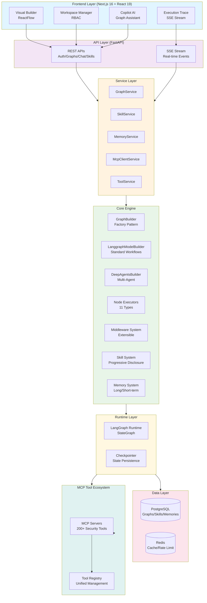
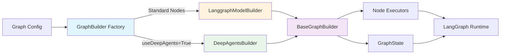
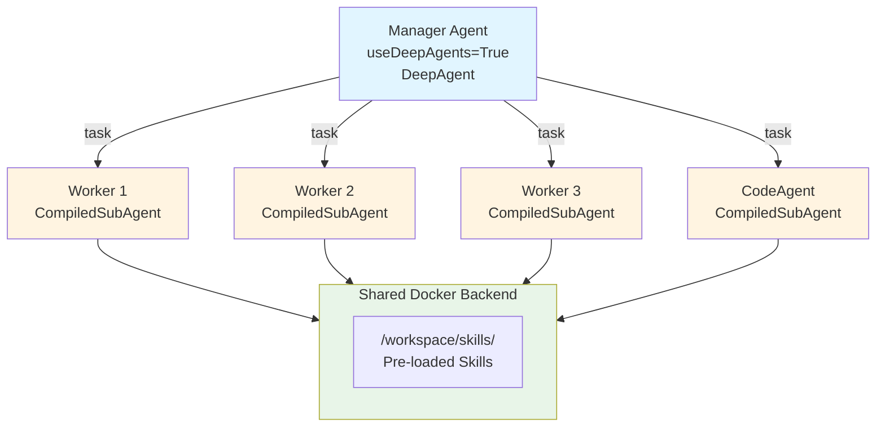
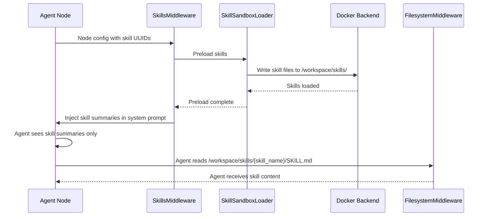
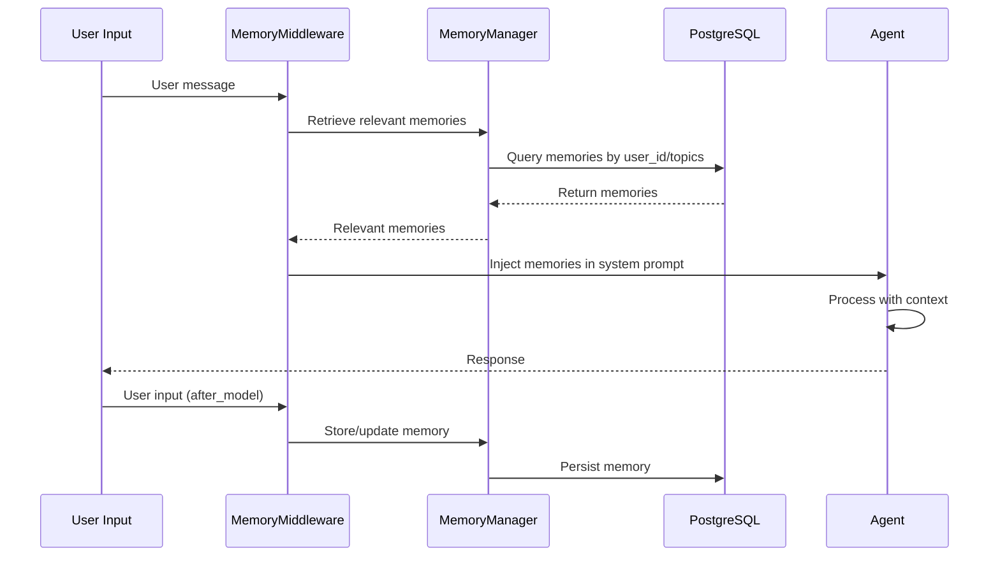
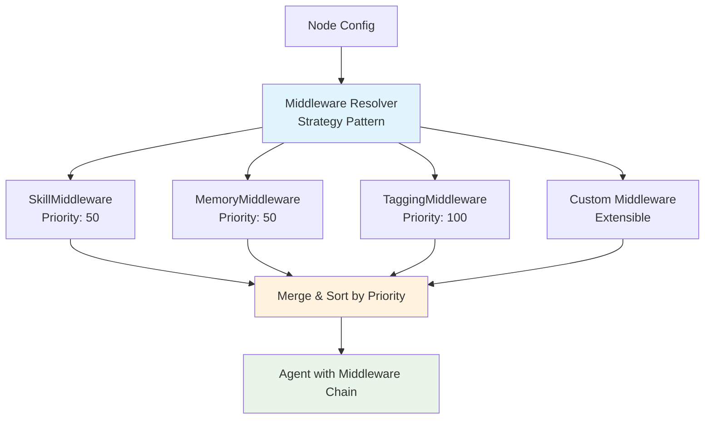
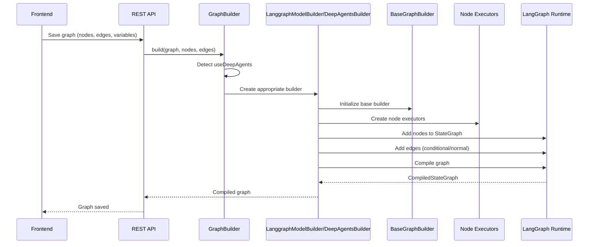
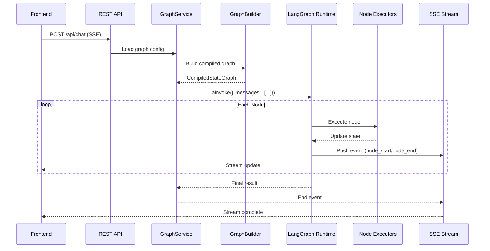
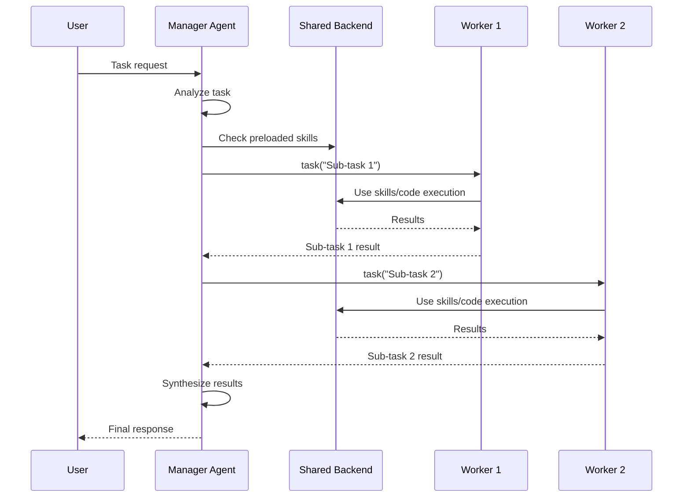

<!-- Logo image placeholder - add docs/assets/logo.png when available -->
<!-- <p align="center">
  
</p> -->

<h1 align="center">JoySafeter</h1>

<p align="center">
  <strong>Build Production-Grade AI Security Agents in 3 Minutes</strong>
</p>

<p align="center">
  Enterprise-grade intelligent agent orchestration platform with SOTA security capabilities
</p>

<p align="center">
  <a href="https://www.apache.org/licenses/LICENSE-2.0"></a>
  <a href="https://www.python.org/downloads/"></a>
  <a href="https://nodejs.org/"></a>
  <a href="https://github.com/langchain-ai/langgraph"></a>
  <a href="https://fastapi.tiangolo.com/"></a>
  <a href="#"></a>
</p>

<p align="center">
  English | <a href="./README_CN.md">简体中文</a>
</p>

<p align="center">
  <a href="#features">Features</a> •
  <a href="#quick-start">Quick Start</a> •
  <a href="#roadmap">Roadmap</a> •
  <a href="#documentation">Documentation</a> •
  <a href="#contributing">Contributing</a>
</p>

<!-- Screenshot placeholder - add docs/assets/screenshot-builder.png when available -->
<!-- <p align="center">
  
</p> -->

---

## Why JoySafeter?

> **JoySafeter is not just a productivity tool, but an "operating system" for security capabilities.**  
> It unifies fragmented security tools into a collaborative AI army through visual intelligent orchestration, and precipitates individual expert experience into organizational digital assets. It is the first to define a new paradigm of **AI-driven Security Operations (AISecOps)** in the industry.

<table>
<tr>
<td width="50%">

### For Enterprise Security Teams

- **Visual Development** — No-code agent builder for rapid prototyping
- **200+ Security Tools** — Pre-integrated Nmap, Nuclei, Trivy, and more
- **Governance & Audit** — Full execution tracing and observability
- **Multi-tenancy** — Isolated workspaces with role-based access

</td>
<td width="50%">

### For AI Security Researchers

- **Graph-based Workflows** — Complex control flows with loops, conditionals, and parallel execution
- **Memory Evolution** — Long/short-term memory for continuous learning
- **MCP Protocol** — Model Context Protocol for unlimited tool extensibility
- **DeepAgents Mode** — Multi-level hierarchical agent orchestration

</td>
</tr>
</table>

---

## Dual-Mode Architecture: Rapid & Deep

JoySafeter offers two distinct modes to meet diverse operational needs:

<table>
<tr>
<td width="50%">

### ⚡ Rapid Mode

**Value Proposition**: Describe requirements → Auto-orchestrate Skills → Auto-team formation → Minute-level deployment

**Key Benefits**:
- 🚀 **Zero-Barrier Entry**: Natural language requirements, AI automatically understands and orchestrates
- 🎯 **Intelligent Matching**: Platform auto-matches optimal Skills combinations, builds professional Agent teams
- ⏱️ **Minute-Level Deployment**: From requirements to runnable Agent in 3-5 minutes
- 🔄 **Out-of-the-Box**: Built-in 10+ core security scenario templates, one-click activation

**Use Cases**:
- Rapid security assessment and vulnerability scanning
- Standardized security detection workflows
- Quick onboarding for beginners
- Emergency security incident response

</td>
<td width="50%">

### 🎨 Deep Mode

**Value Proposition**: Visual orchestration → Debugging → Observability → Continuous iteration for professional team collaboration

**Key Benefits**:
- 🏗️ **Visual Orchestration**: Drag-and-drop complex workflows, 11 node types, supports loops, conditions, parallel execution
- 🔍 **Full-Stack Debugging**: Real-time execution tracing, state visualization, breakpoint debugging, precise problem localization
- 📊 **Enterprise Observability**: Langfuse integration, complete execution trace tracking and performance analytics
- 🔄 **Continuous Evolution**: Version control, A/B testing, memory evolution, Agents get smarter over time

**Use Cases**:
- Complex multi-step security research tasks
- Customized security detection workflows
- Enterprise-grade security operations platform
- Professional security team collaboration

</td>
</tr>
</table>

---

## Features

### Core Value Propositions

<table>
<tr>
<td align="center" width="25%">
<h4>Intelligent Team Orchestration</h4>
<strong>Automated Multi-Agent Task Force Construction</strong><br/>
Intelligent task decomposition and collaborative execution, breaking complex security tasks into specialized Agent team collaboration
</td>
<td align="center" width="25%">
<h4>Cognitive Evolution Engine</h4>
<strong>Continuously Learning Security Agents</strong><br/>
Memory-based learning with long/short-term strategies, automatically accumulating "tacit knowledge" from offensive/defensive practices for continuous self-iteration
</td>
<td align="center" width="25%">
<h4>Scenario-Based Capability Matching</h4>
<strong>Out-of-the-Box Scenario Library</strong><br/>
Pre-built scenarios including penetration testing, APK deep analysis, MCP compliance scanning, replicating DeepResearch workflows with 95%+ accuracy
</td>
<td align="center" width="25%">
<h4>Skill Matrix Platform</h4>
<strong>Modular Security Capability Reuse</strong><br/>
Pre-configured 10+ core security Skills and 200+ toolchains for modular reuse and building-block assembly
</td>
</tr>
</table>

### Technical Capability Matrix

<table>
<tr>
<td align="center" width="25%">
<h4>Visual Orchestration Engine</h4>
<sub>ReactFlow-powered drag-and-drop workflow builder, 11 node types, supports complex control flows</sub>
</td>
<td align="center" width="25%">
<h4>MCP Tool Protocol</h4>
<sub>Model Context Protocol for seamless integration with 200+ security tools and custom APIs</sub>
</td>
<td align="center" width="25%">
<h4>Progressive Skill System</h4>
<sub>Token-efficient skill disclosure mechanism, on-demand loading, supports 200+ skill expansion</sub>
</td>
<td align="center" width="25%">
<h4>Real-time Streaming</h4>
<sub>Server-Sent Events for full-stack real-time observability, providing complete views of execution status, performance metrics, and error tracking</sub>
</td>
</tr>
<tr>
<td align="center" width="25%">
<h4>Enterprise Observability</h4>
<sub>Langfuse integration for complete execution trace tracking, monitoring, and performance analytics</sub>
</td>
<td align="center" width="25%">
<h4>Multi-tenant Workspaces</h4>
<sub>Granular permission control and RBAC, supports enterprise-grade workspace isolation and collaboration</sub>
</td>
<td align="center" width="25%">
<h4>Human-in-the-Loop</h4>
<sub>Workflow interruption and resumption, human approval checkpoints for complex decision flows</sub>
</td>
<td align="center" width="25%">
<h4>Sandbox Execution</h4>
<sub>Secure Python code execution environment for custom function nodes and dynamic code generation</sub>
</td>
</tr>
</table>

### Key Features & Innovations

#### 1. Visual Orchestration Engine

**Drag-and-Drop Interface** powered by ReactFlow:
- **11 Node Types**: Agent, Control Flow, Actions, Data, Aggregation
- **Real-time Preview**: See graph structure as you build
- **Auto-layout**: Automatic node positioning and edge routing
- **Edge Configuration**: Conditional edges, loop-back edges, route keys
- **Validation**: Real-time graph structure validation

**Key Capabilities:**
- Enterprise-grade visual workflow design for complex security tasks without coding
- Powerful control flow engine supporting loop iteration, conditional branching, parallel execution, and result aggregation
- DeepAgents mode visualization with Manager-Worker star topology architecture for multi-agent collaboration
- Context variable management and state passing for complex workflow state sharing
- Graph versioning and deployment management with version rollback and history tracking

#### 2. DeepAgents Multi-Agent Orchestration

**Manager-Worker Star Topology** for complex task decomposition:

- **Automatic Detection**: System auto-detects `useDeepAgents` configuration
- **Star Topology**: Manager connects directly to all SubAgents (not chain)
- **Shared Backend**: Docker backend shared across agents for resource optimization
- **Skill Preloading**: Skills preloaded to `/workspace/skills/` before execution
- **Task Delegation**: Manager uses `task()` tool to coordinate SubAgents

**Use Cases:**
- Complex multi-step security research tasks requiring specialized Agent team collaboration
- Large-scale security analysis workflows involving deep analysis across multiple specialized domains
- Parallel task processing with result aggregation for improved overall execution efficiency
- Hierarchical decision-making and task delegation scenarios for intelligent task distribution and coordination

#### 3. Progressive Skill Disclosure

**Token-Efficient Skill System** that reduces context window usage:

| Component | Description |
|-----------|-------------|
| **SkillService** | CRUD operations with permission control, skill tagging and categorization |
| **SkillsMiddleware** | Injects skill descriptions into agent system prompts automatically (uses deepagents SkillsMiddleware) |
| **SkillSandboxLoader** | Preloads skills to Docker backend before execution |
| **FilesystemMiddleware** | Agent directly reads skill files from `/workspace/skills/{skill_name}/` via filesystem access |
| **Progressive Disclosure** | Shows skill summaries first, loads full content when needed |

**Key Benefits:**
- **Token-Efficient Optimization**: Progressive skill disclosure mechanism loads full skill content only when needed, significantly reducing context window usage
- **Enterprise Scalability**: Supports 200+ skill expansion without context overflow, meeting large-scale security capability matrix requirements
- **High-Performance Access**: Skills preloaded to Docker backend enable millisecond-level skill content access, improving Agent execution efficiency
- **Dynamic Capability Discovery**: Agents can dynamically discover and use skills, enabling flexible combination and on-demand invocation of security capabilities

#### 4. Long/Short-term Memory System

**Persistent Memory** across sessions for continuous learning:

- **Memory Types**: Fact, Procedure, Episodic, Semantic
- **Retrieval Methods**: Last N, First N, Agentic retrieval
- **Memory Middleware**: Automatic memory injection and storage
- **Topic-based Organization**: Memories organized by topics for efficient retrieval
- **Importance Scoring**: Memories ranked by importance and relevance

**Memory Flow:**
1. **Pre-Model Memory Injection**: Intelligently retrieves relevant memories and injects them into system prompts, providing context-aware capabilities for Agents
2. **Post-Model Memory Accumulation**: Automatically stores user inputs and Agent responses as new memories, enabling continuous accumulation of knowledge assets
3. **Continuous Evolutionary Learning**: Memory system continuously optimizes over time, Agent performance improves continuously, achieving self-iteration of security capabilities

#### 5. Extensible Middleware Architecture

**Strategy Pattern** for easy middleware extension:

- **Priority System**: Middleware executed in priority order (0-100)
- **Error Isolation**: Failed middleware doesn't break others
- **Strategy Resolvers**: Easy to add new middleware types
- **Backward Compatible**: New features don't affect existing code

**Built-in Middleware:**
- **SkillMiddleware** (Priority: 50): Intelligent skill injection middleware that automatically injects skill descriptions into Agent system prompts
- **MemoryMiddleware** (Priority: 50): Memory retrieval and storage middleware for persistent memory management across sessions
- **TaggingMiddleware** (Priority: 100): Observability and monitoring middleware providing full-stack execution tracing and performance analytics

#### 6. AI Copilot for Graph Building

**Intelligent Assistant** for graph construction:

- **Topology Analysis**: Analyzes current graph structure
- **Smart Recommendations**: Suggests nodes and connections
- **DeepAgents Guidance**: Provides architecture guidance for multi-agent workflows
- **Auto-positioning**: Calculates optimal node positions
- **Validation**: Validates graph structure and suggests improvements

**Key Capabilities:**
- Natural language-driven graph creation, automatically converting requirement descriptions into visual workflows
- Intelligent multi-agent team design assistance with architecture guidance and role allocation recommendations
- Workflow topology analysis and optimization suggestions to improve execution efficiency and resource utilization
- Automatic best practices enforcement to ensure workflow design meets industry standards and security specifications

### Technical Highlights

#### 1. Advanced Routing System

**Flexible Control Flow** with multiple routing patterns:

- **Conditional Routing**: Binary conditions (true/false)
- **Multi-rule Routing**: Router node with priority-based rules
- **Loop Control**: forEach, while, doWhile patterns
- **Parallel Execution**: Fan-Out/Fan-In with aggregator
- **Command Mode**: Optional Command object support for explicit routing

**Edge Configuration:**
- **Normal Edges**: Sequential flow
- **Conditional Edges**: Route-based branching
- **Loop-back Edges**: Cycle control with state isolation

#### 3. SSE Real-time Communication

**Standardized Event Envelope** for reliable streaming:

```typescript
interface StreamEventEnvelope {
  type: 'content' | 'tool_start' | 'tool_end' | 'status' | 'error' | 'done';
  node_name: string;      // Current executing node
  run_id: string;         // Group events by execution run
  timestamp: number;      // Event timestamp
  thread_id: string;      // Conversation thread
  data: any;              // Event-specific data
}
```

**Features:**
- **run_id Grouping**: Group events from same execution run
- **node_name Tracking**: Show which agent/node is executing
- **Incremental Updates**: Delta-based content updates
- **Error Handling**: Graceful error propagation

#### 3. MCP Tool Integration

**Native MCP Protocol Support** with 200+ pre-integrated tools:

- **Tool Registry**: Unified tool management and registration
- **Multi-Server Support**: Connect to multiple MCP servers
- **Tool Categories**: Network Scanning, Web Security, Binary Analysis, Container Security, Cloud Security, Attack Strategy, Knowledge Base
- **Custom Tools**: Extend with custom tool implementations
- **Tool Discovery**: Automatic tool discovery from MCP servers

**Tool Execution:**
- Direct MCP protocol communication
- Tool result caching and error handling
- Support for async tool execution
- Tool metadata and documentation

### Security-Specific Features

| Category | Tools Count | Capabilities |
|----------|-------------|--------------|
| **Network Scanning** | 15+ | Nmap, Masscan, ZMap, port discovery |
| **Web Security** | 14+ | SQLi, XSS, SSRF, authentication testing |
| **Vulnerability Scanning** | 5+ | Nuclei, Nikto, comprehensive CVE detection |
| **Binary Analysis** | 14+ | Ghidra, radare2, angr, JEB APK analysis |
| **Container Security** | 7+ | Trivy, Clair, Docker image scanning |
| **Cloud Security** | 4+ | Prowler, ScoutSuite, AWS/GCP auditing |
| **Attack Strategies** | 90+ | Attack chain generation, risk assessment |
| **Knowledge Base** | 115+ | Security knowledge YAML patterns |

---

## Architecture

### Overall Architecture

JoySafeter follows a layered architecture pattern with clear separation of concerns:



### Core Modules

#### 1. Graph Builder System

The graph builder system uses a factory pattern to automatically select the appropriate builder based on graph configuration:



**Key Components:**
- **GraphBuilder**: Factory class that auto-detects configuration and selects builder
- **LanggraphModelBuilder**: Builds standard LangGraph workflows with 11 node types
- **DeepAgentsGraphBuilder**: Builds Manager-Worker star topology for multi-agent collaboration
- **BaseGraphBuilder**: Base class providing common functionality (node/edge management, executor creation)

#### 2. DeepAgents Multi-Agent Orchestration

DeepAgents implements a star topology with one Manager coordinating multiple Workers:



**Features:**
- **Star Topology**: Manager connects directly to all SubAgents (not chain)
- **Shared Backend**: Docker backend shared across agents for skills and code execution
- **Skill Preloading**: Skills loaded to `/workspace/skills/` before execution
- **Task Delegation**: Manager uses `task()` tool to delegate work to SubAgents

#### 3. Skill System (Progressive Disclosure)

The skill system implements progressive disclosure to reduce token consumption:



**Components:**
- **SkillService**: CRUD operations with permission control
- **SkillsMiddleware**: Automatically injects skill descriptions into system prompts
- **SkillSandboxLoader**: Preloads skills to Docker backend before execution
- **FilesystemMiddleware**: Agent directly reads skill files from `/workspace/skills/{skill_name}/` via filesystem access (skills are preloaded by SkillSandboxLoader before execution)

#### 4. Memory System (Long/Short-term Memory)

The memory system provides persistent memory across sessions:



**Memory Types:**
- **Fact**: Factual knowledge (target info, vulnerabilities)
- **Procedure**: Procedural knowledge (successful attack paths)
- **Episodic**: Session-specific experiences
- **Semantic**: General security knowledge

#### 5. Middleware Architecture

Extensible middleware system using strategy pattern:



**Features:**
- **Strategy Pattern**: Easy to add new middleware types
- **Priority System**: Middleware executed in priority order
- **Error Isolation**: Failed middleware doesn't break others
- **Backward Compatible**: New features don't affect existing code

#### 6. Node Executors (11 Types)

| Category | Node Types | Description |
|----------|------------|-------------|
| **Agent** | `agent`, `llm_node` | LLM-powered reasoning with tool access |
| **Control Flow** | `condition`, `router_node`, `loop_condition_node` | Conditional branching, multi-path routing, iteration |
| **Actions** | `tool_node`, `function_node`, `http_request_node` | Tool execution, sandbox code, HTTP calls |
| **Data** | `json_parser_node`, `direct_reply` | JSON parsing, template responses |
| **Aggregation** | `aggregator_node` | Parallel result collection |

### Core Workflows

#### Graph Building Flow



#### Graph Execution Flow



#### DeepAgents Execution Flow



### Data Flow

**Frontend ↔ Backend:**
- **REST API**: Graph configuration, skill management, tool management, workspace operations
- **SSE Stream**: Real-time execution status, streaming output, node execution events

**Backend Internal:**
- **GraphBuilder → NodeExecutors → LangGraph Runtime**: Graph construction and execution
- **LangGraph Runtime → MCP Servers → Tools**: Tool invocation and execution
- **Middleware → Agent → Model**: Request processing pipeline

**Backend ↔ Data Layer:**
- **PostgreSQL**: Graph configurations, skills, memories, sessions, workspaces
- **Redis**: Cache, rate limiting, session state, temporary data

---

## Tech Stack

| Layer | Technology | Purpose |
|-------|------------|---------|
| **Frontend** | Next.js 16, React 19, TypeScript | Server-side rendering, App Router |
| **UI Components** | Radix UI, Tailwind CSS, Framer Motion | Accessible, animated components |
| **State Management** | Zustand, TanStack Query | Client & server state |
| **Graph Visualization** | React Flow | Interactive node-based editor |
| **Backend** | FastAPI, Python 3.12+ | Async API with OpenAPI docs |
| **AI Framework** | LangChain 1.2+, LangGraph 1.0+, DeepAgents | Agent orchestration & workflows |
| **MCP Integration** | mcp 1.20+, fastmcp 2.14+ | Tool protocol support |
| **Database** | PostgreSQL, SQLAlchemy 2.0 | Async ORM with migrations |
| **Caching** | Redis | Session cache & rate limiting |
| **Observability** | Langfuse, Loguru | Tracing & structured logging |

---

## Quick Start

### Prerequisites

| Requirement | Version |
|-------------|---------|
| Docker | 20.10+ |
| Docker Compose | 2.0+ |
| Python | 3.12+ (for local development) |
| Node.js | 20+ (for local development) |
| PostgreSQL | 15+ (optional, if not using Docker) |
| Redis | 7+ (required, used for caching and session management) |

### One-Command Setup (Docker) - Recommended

The easiest way to get started:

```bash
git clone https://github.com/jd-opensource/JoySafeter.git
cd JoySafeter/deploy

# Quick start (automatically handles configuration and startup)
./quick-start.sh
```

Access the application at **http://localhost:3000**

### Using Pre-built Docker Images

We provide pre-built Docker images on GitHub Container Registry. You can use them directly:

```bash
# Pull images from GitHub Container Registry
docker pull docker.io/jdopensource/joysafeter-backend:latest
docker pull docker.io/jdopensource/joysafeter-frontend:latest
docker pull docker.io/jdopensource/joysafeter-mcp:latest

# Or use docker-compose with pre-built images
cd deploy
export DOCKER_REGISTRY=docker.io/jdopensource
docker-compose -f docker-compose.prod.yml up -d
```

**Available Images:**
- `docker.io/jdopensource/joysafeter-backend:latest` - Backend API service
- `docker.io/jdopensource/joysafeter-frontend:latest` - Frontend web application
- `docker.io/jdopensource/joysafeter-mcp:latest` - MCP server with security tools
- `docker.io/jdopensource/joysafeter-init:latest` - Database initialization service

All images support multi-architecture (amd64, arm64).

### Alternative Setup Methods

#### Option 1: Interactive Installation

Use the installation wizard to configure your environment:

```bash
cd deploy

# Interactive installation
./install.sh

# Or quick install for development
./install.sh --mode dev --non-interactive
```

After installation, start services with scenario-specific scripts:

```bash
# Development scenario
./scripts/dev.sh

# Production scenario
./scripts/prod.sh

# Test scenario
./scripts/test.sh

# Minimal scenario (middleware only)
./scripts/minimal.sh

# Local development (backend/frontend run locally)
./scripts/dev-local.sh
```

#### Option 2: Manual Docker Compose

For advanced users who want full control:

```bash
cd deploy

# 1. Create configuration files
cp .env.example .env
cd ../backend && cp env.example .env

# 2. Start middleware (PostgreSQL + Redis)
cd ../deploy
./scripts/start-middleware.sh

# 3. Start full services
docker-compose up -d
```

#### Option 3: Environment Check

Before starting, you can check your environment:

```bash
cd deploy
./scripts/check-env.sh
```

This will verify:
- Docker installation and status
- Docker Compose version
- Port availability
- Configuration files
- Disk space

### Manual Setup

<details>
<summary><strong>Backend Setup</strong></summary>

```bash
cd backend

# Install uv package manager
curl -LsSf https://astral.sh/uv/install.sh | sh

# Create environment and install dependencies
uv venv && source .venv/bin/activate
uv sync

# Configure environment
cp env.example .env
# Edit .env with your settings

# Initialize database
createdb joysafeter
alembic upgrade head

# Start server
uv run uvicorn app.main:app --reload --port 8000
```

</details>

<details>
<summary><strong>Frontend Setup</strong></summary>

```bash
cd frontend

# Install dependencies
bun install  # or: npm install

# Configure environment
cp env.example .env.local

# Start development server
bun run dev
```

</details>

### Access Points

| Service | URL |
|---------|-----|
| Frontend | http://localhost:3000 |
| Backend API | http://localhost:8000 |
| API Documentation | http://localhost:8000/docs |
| ReDoc | http://localhost:8000/redoc |

---

## Roadmap

### Completed

- [x] LangGraph-based graph orchestration engine
- [x] Visual Agent Builder with 11 node types
- [x] MCP tool protocol integration
- [x] 200+ security tool handlers
- [x] Multi-Agent orchestration (DeepAgents)
- [x] Long/short-term memory system
- [x] Skill System with progressive disclosure
- [x] SkillsMiddleware for agent skill injection (using deepagents SkillsMiddleware)
- [x] Direct filesystem access for skill loading (Agent reads from `/workspace/skills/` via FilesystemMiddleware)
- [x] SSE real-time streaming output
- [x] Multi-tenant workspace isolation
- [x] Langfuse observability integration
- [x] Docker deployment solution
- [x] RBAC permission control
- [x] API Key management
- [x] Extensible middleware architecture
- [x] Sandbox execution for custom Python code

### In Progress

- [ ] Unit test coverage (target 80%+)
- [ ] API documentation enhancement
- [ ] User guide (EN/CN bilingual)
- [ ] Developer documentation

### Planned

- [ ] MCP Tool Marketplace
- [ ] Multi-model support (Claude, Gemini, open-source models)
- [ ] Middleware caching mechanism
- [ ] Graph compilation optimization
- [ ] Enterprise case studies
- [ ] Community plugin ecosystem

---

## Comparison

| Feature | JoySafeter | Dify | Flowise | n8n | Coze |
|---------|------------|------|---------|-----|------|
| **Security Focus** | Native | - | - | - | - |
| **LangGraph Native** | Yes | No | No | No | No |
| **Multi-Agent (DeepAgents)** | Yes | Limited | No | No | Limited |
| **MCP Protocol** | Yes | No | No | No | No |
| **200+ Security Tools** | Yes | No | No | No | No |
| **Skill System** | Yes | No | No | No | No |
| **Memory Evolution** | Yes | Basic | Basic | No | Basic |
| **Open Source** | Apache 2.0 | Apache 2.0 | Apache 2.0 | Fair-code | Closed |
| **Self-Hosted** | Yes | Yes | Yes | Yes | No |
| **Loop/Parallel Control** | Advanced | Basic | Basic | Yes | Limited |
| **Enterprise RBAC** | Yes | Yes | Limited | Yes | Yes |

---

## Documentation

| Document | Description |
|----------|-------------|
| [Layered Architecture](docs/layered-architecture.md) | Complete 7-layer architecture overview from presentation to infrastructure |
| [Graph Builder Architecture](docs/GRAPH_BUILDER_ARCHITECTURE.md) | Complete system design, data flow, and node type reference |
| [Middleware Architecture](docs/middleware-architecture-complete.md) | Extensible middleware system with strategy pattern |
| [MCP Skills Integration](docs/mcp-skills-integration.md) | MCP tool to skill conversion and integration guide |
| [SSE Protocol Migration](docs/sse-protocol-migration.md) | Real-time streaming protocol and event structure |
| [LangGraph Improvements](docs/langgraph-improvements-summary.md) | State separation and Command mode enhancements |
| [Backend Guide](backend/README.md) | API reference and backend configuration |
| [Frontend Guide](frontend/README.md) | Component library and state management |
| [Docker Deployment Guide](deploy/README.md) | Complete deployment guide with installation scripts, scenarios, and troubleshooting |
| [Development Guide](DEVELOPMENT.md) | Local development setup and workflow |
| [Contributing](CONTRIBUTING.md) | How to contribute to the project |
| [Security Policy](SECURITY.md) | Security policy and vulnerability reporting |
| [Code of Conduct](CODE_OF_CONDUCT.md) | Community guidelines |

---

## Contributing

We welcome contributions from the community! See our [Contributing Guide](CONTRIBUTING.md) for details.

```bash
# Fork and clone
git clone https://github.com/jd-opensource/JoySafeter.git

# Create feature branch
git checkout -b feature/amazing-feature

# Make changes and commit
git commit -m 'feat: add amazing feature'

# Push and create PR
git push origin feature/amazing-feature
```

---

## License

This project is licensed under the **Apache License 2.0** — see the [LICENSE](LICENSE) file for details.

> **Note:** This project includes third-party components with different licenses. See [THIRD_PARTY_LICENSES.md](THIRD_PARTY_LICENSES.md) for details.

---

## Acknowledgments

<table>
<tr>
<td align="center"><a href="https://github.com/langchain-ai/langchain"><br/><sub>LangChain</sub></a></td>
<td align="center"><a href="https://github.com/langchain-ai/langgraph"><br/><sub>LangGraph</sub></a></td>
<td align="center"><a href="https://fastapi.tiangolo.com/"><br/><sub>FastAPI</sub></a></td>
<td align="center"><a href="https://nextjs.org/"><br/><sub>Next.js</sub></a></td>
<td align="center"><a href="https://www.radix-ui.com/"><br/><sub>Radix UI</sub></a></td>
</tr>
</table>

---

<p align="center">
  <sub>Made with ❤️ by the JoySafeter Team</sub>
</p>

---

<p align="center">
  <sub>For commercial solutions, please contact JD Technology Solutions Team at <a href="mailto:org.ospo1@jd.com">org.ospo1@jd.com</a></sub>
</p>
